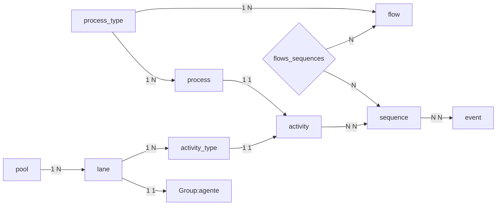

[](https://opensource.org/licenses/MIT)


Este trabalho foi patrocinado pela Fundação de Apoio à Pesquisa do Distrito Federal (FAP-DF), no âmbito do projeto “Sistemas de informações organizacionais flexíveis baseados em processos de negócios com orientação semântica contextual”; outorga SEI 00193-00000096 / 2019-78.

This research has been sponsored by Fundação de Apoio à Pesquisa do Distrito Federal (FAP-DF), under the project “Flexible organizational information systems based on business processes with contextual semantic guidelines.” Grant Number SEI 00193-00000096/2019-78.


# BPMN

This project implements part of a semantic framework directed to Business Process Management Notation.

## Instalação e configuração

### Usando Docker

Requires Docker and docker-compose installed. 
1. Download and Install docker
    - [MacOS](https://www.docker.com/products/docker-desktop) 
    - [Debian](https://docs.docker.com/engine/install/debian/#installation-methods)
    - [Ubuntu](https://docs.docker.com/engine/install/ubuntu/)
2. [Download and Install docker-compose here](https://docs.docker.com/compose/install/)

In root directory run ```docker-compose up```. App will start and run in port localhost:3000

#### Debug

Run bash inside the application container. Run ```docker exec -it sfdjango_djangoapp_1 bash``` in another terminal while the container is running.
### Sem Docker
1.  Instalação do Python 3.7
    Windows: Certifique-se que se trata da versão de 64 bits e escolha no instalador a opção de inclusão 
    da variável de ambiente no path. Após instalado, verifique a instalação através do comando 
    python --version no terminal do windows que você utiliza.
2.  Instalação do virtualenv
    No terminal, faça a intalação do virualenv através do comando "pip install virtualenv".

3. Instalar o ambiente virtual na pasta do projeto.
    Comando: virtualenv venv
    Observação: Caso esteja trabalhando no Windows sem uma IDE como PyCharm, é necessário ativar e desativar o ambiente virtual.
    O arquivo activate ativa o ambiente e o deactivate o desativa. Ambos scripts se encontram na pasta Script do venv criado.
    Ainda do Windows, a execução de scripts pode estar desabilitada. Logo, para executar o comando activate será necessário 
    definir a política de execução para o usuário através do comando "Set-ExecutionPolicy -ExecutionPolicy RemoteSigned -Scope CurrentUser".
4. Instalar os pacotes necessários.
    Para instalar os pacotes necessários, com o ambiente virtual ativo, execute o comando  `pip install -r requirements.txt`.
    Obs.: No Windows será necessário ter instalado o Microsoft C++ Build Tools para que os pacotes possam ser compilados.
5. Instalar o PostgreeSQL.
    Observação: O projeto foi desenvolvido com a versão 13 do PostgreeSQL. Versões superiores do Python podem apresentar incompatibilidade
    no Windows.
6. (opcional): Criar o DB da aplicação caso não exista.
    No Windows o banco de dados pode ser criado através da aplicação PGAdmin. O nome do banco de dados deve ser
    bpmn e a senha 123456. Alterações nessas informações implicam em configuração do arquivo settings.py.
7. Criar super usuário para a aplicação.
    Comando: python manage.py createsuperuser
8. Criar as tabelas da aplicação no banco de dados.
    Comando: `python manage.py makemigrations`
             `python manage.py migrate`
9. Teste a intalação do django rodando o servidor local.
    Comando: `python manage.py runserver`

`python -c "import nltk; nltk.download('punkt')"`

### Seed Database

`python3 manage.py shell < seed.py`

### Testing

Executando ```pytest```
```bash
pytest
pytest a_directory                     # directory
pytest test_something.py               # tests file
pytest test_something.py::single_test  # single test function
```
### static files
```
python manage.py collectstatic
```

# Ontologia OWL
anotação da ontologia para os ** agentes**  e ** processos**  seguem o modelo do questionário no trabalho [BBO_BPMNbasedOntology](https://github.com/AminaANNANE/BBO_BPMNbasedOntology/blob/master/Competency%20questions.txt). A modelagem respondendo as  perguntas listadas, podemos resolver as seguintes validações:

**Processo** 
 1. Quais atividades devem preceder uma determinada atividade;
 2. Qual é a atividade seguinte/anterior;
 3. Quais atividades precisam ser concluídas primeiro para iniciar esta atividade;
4. Que atividades acontecem antes (ou em paralelo, ou depois) desta atividade;
5. Qual é a primeira/última atividade de um determinado processo;
6. Quais atividades obrigatórias de um processo;

**Agente** 
1. Quem deve/pode realizar determinada atividade;
2. A quem um determinado funcionário se reporta;


## Modelagem OWL no PRÓTÉGÉ
#### AGENTES
Cada **Agente** tem uma `classe`. ex: Repórter, editor, secretário de redação e chefe de reportagem e um indivíduo genérico. As classes seguem a anotação *PascalCase*.  E os indivíduos o `snake_case`.

|                |Classe                          |indivíduo                        |
|----------------|-------------------------------|-----------------------------|
|Repórter|`Reporter` |`reporter`|
|Editor|`Editor`|`editor`|
|secretário de redação|`SecretárioDeRedação`|`secretário_de_redação` |
|chefe de reportagem|`ChefeDeReportagem` |`chefe_de_reportagem`|

#### PROCESSOS
Um **processo** é modelado como uma `classe`, e as **tarefas** do processo modelados como `indivíduos` desta `classe`.

No momento o único processo anotado é o **produção da publicação**

|                |Classe                          |indivíduo                        |
|----------------|-------------------------------|-----------------------------|
|processos|`Processo` |`produção_da_publicação`|


## Modelagem do processo e validações semanticas
As validações implementadas são os tópicos Agentes 1. e Processos 6.
na rota `GET /process-modeling/` para modelagem de um novo processo ou recarregar um processo existente. As validações são feitas em tempo real durante a modelagem. Notificações de validações aparecem na aba notificações. Ao salvar um diagrama, um processo será salvo e associado ao diagrama do processo modelado.

###  class  DiagramParserUtils
Responsável por ler um diagrama em linguagem `XML` e traduzir para a estrutura de entidades relacionais no `Django` e modelado na linguagem `SQL`. Detecta as entidades BPMN no documento XML e as converte para entidade relacional. ex: pool, event, sequence, lane, tasks, etc.

### class  NewsroomProcessUtils
Responsável por concentrar as funcionalidades de apoio para a um processo. Faz acesso SPARQL na OWL do processo, executa as validações, consulta as tarefas de um **agente**, etc.

## View

### class  OntologySuggestionView(View)
`POST /ontology-suggestion`
Responsável pela validação do diagrama durante a modelagem do diagrama. Recebe os elementos do diagrama BPMN em modelagem e faz a validação de, se a tarefa executada pelo Agente certo e se o processo está em falta de alguma tarefa. Recebe parametros em `JSON` e retorna em `JSON`.

### class ProcessModelingView(TemplateView)
`GET /process-modeling/`
Renderiza a tela de modelagem de diagrama(processo) `bpmn/process_modeling.html`.

#### Template bpmn/process_modeling.html
Durante a modelagem é feito a validação em tempo real através de eventos de click no canvas. O template utiliza das bibliotecas [bpmn.io](https://bpmn.io/), [Vue.js](https://vuejs.org/guide/introduction.html) e [Bootstrap 4](https://getbootstrap.com/docs/4.0/getting-started/introduction/) importadas via **cdn**. A validação é feita construindo a  `Array diagramElements` :
1. Os eventos de click no diagrama chamam o metodo `diagramEvent()` ;
2. dispara uma passagem pelo objeto `XML` que atualiza o this.diagramElements e reseta a lista de erros caso exista;
3.  `updateDiagramElements()` atualiza `diagramElements` com os elementos BPMN encontrados no diagrama;
4. Se o click for detectado dentro de uma tarefa ou na criação de uma tarefa nova, será chamada a rota `POST /ontology-suggestion` com o parametro `diagramElements`. Com a resposta é feito as validações e caso existam, serão notificadas na coluna de notificações;


## Modelos Relacionais
Mapeamento dos elementos do diagrama BPMN em entidades relacionais.
Andamento do processo é acompanhado pelo ```process``` que aponta para a tarefa aonde o processo se encontra. `Group`




